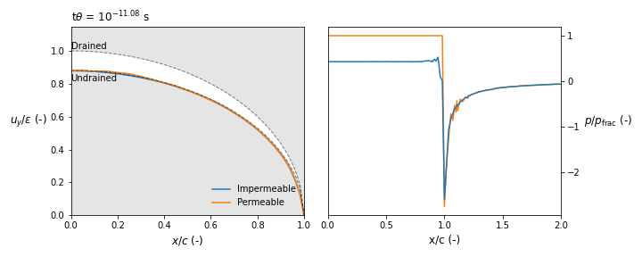

# Development of a fracture in homogenous media

Modelling the development of a pressurized, non-propagating fracture in homogenous media with finite elements. Made as a final project for the course Computational geomechanics. The file ```report/Pressurized fracture.pdf``` contains a short synthesis of the work done and the mathematical development.



The python code in the FEM folder is translated from Matlab code developped by the [Geo-Energy Lab](https://www.epfl.ch/labs/gel/fr/index-fr-html/), based at the École Polytechnique Fédérale de Lausanne, [accessible here](https://github.com/GeoEnergyLab-EPFL/Civil-423-2022/tree/week_9_tag).

Most of the python code relies on a [simple anaconda distribution](https://docs.anaconda.com/anaconda/install/index.html) (i.e. numpy, scipy, matplotlib) but needs the functions from the [triangles library](https://github.com/drufat/triangle). It can be easily installed with the command

``pip install triangle``

You also can install everything needed at once for an empty environment with the command

``pip install -r requirements.txt``

The code used to generate the results and the figures is located in ``Notebooks/Fracture in homogenous medium.ipynb``. It can be easily accessed online from a binder environment [here](https://mybinder.org/v2/gh/aleximorin/Fracture/HEAD) (it can take a few minutes to load).
